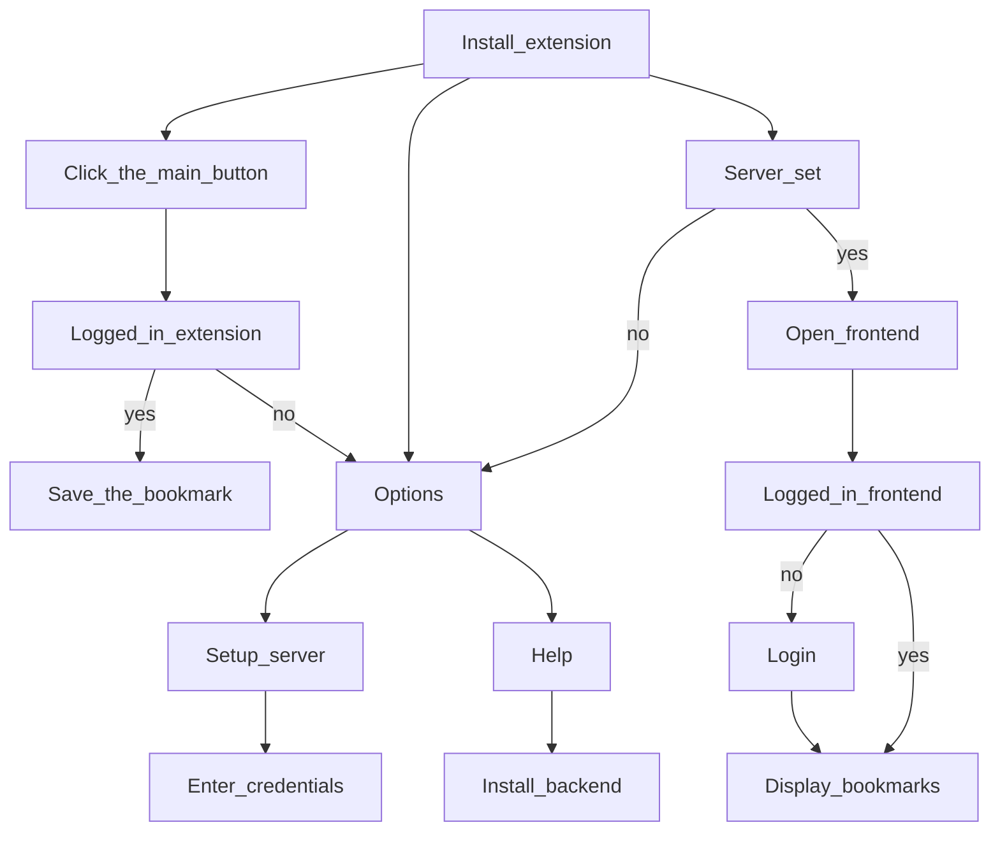

# Bookmarker

A simple, self-hosted bookmarking application with a cross-platform browser extension and a web interface for managing bookmarks.

## Features

- 🔖 **Save bookmarks** from your browser with a single click
- 📱 **Mobile support** works on Firefox Android
- 🎨 **List** saved bookmarkds
- 🗂️ **Archive** read bookmarks
- 🔐 **Secure authentication** with JWT tokens
- 🐳 **Docker support** for easy deployment

## Architecture

The application consists of three main components:

1. **Backend API** - FastAPI server with SQLite database
2. **Web UI** - React-based frontend for managing bookmarks
3. **Browser Extension** - Cross-browser extension (Firefox Desktop/Android, Chrome)

## Prerequisites

- Production
   - Docker
- Development
   - Python 3.11+
   - Node.js 18+
   - Firefox browser

# Setup

## Install Backend

Setup is supposed to be performed on a machine in the local newort, that is always on, e.g. a Raspberry Pi. This machine should have a fixed IP e.g. 192.168.1.100 or a name my-server.local .

```sh
# Clone the repository
git clone https://github.com/mspnr/bookmarker
cd bookmarker

# Copy .env
cp .env.example .env
# Edit .env - set SECRET_KEY - a random string, generated by one of two commands:
openssl rand -base64 64
python -c 'import secrets; print(secrets.token_urlsafe(50))'
# Setup external port EXTERNAL_PORT, defaults to 3001

# Build and start the container
docker compose build
docker compose up -d

# Stop the container
docker compose down
```

## First Time Setup

### Create Your Account

1. Open the web UI, e.g. http://my-server.local:3001
2. Click "Don't have an account? Register"
3. Enter your username and password
4. Click "Register"
5. Log in with your new credentials

### Configure Firefox Extension

1. Install the extension
2. Click Bookmarker to open settings (opened only for the first time)
3. Set frontend URL, press Test connection and then press Save
4. Enter credentials and press Login

## Usage

### Saving Bookmarks

1. Navigate to any webpage
2. Click/tap the Bookmarker extension icon
3. Confirmation message will appear, displaying that the page has been saved as a bookmark

### Managing Bookmarks

1. Open the web UI
2. View all your bookmarks (newest first)
3. Use filters to view:
   - **Active** - Unarchived bookmarks
   - **Archived** - Archived bookmarks

### Archiving Bookmarks

- Click the 📥 icon next to a bookmark to archive it
- Click the ↩️ icon to unarchive

### Deleting Bookmarks

- Click the 🗑️ icon next to a bookmark
- Confirm the deletion

## DB util
Interactive CLI tool for resetting user passwords when you have backend access.

```sh
docker compose exec -it backend uv run python db_util.py
```

# User journey



Notes:
- help is this github page, chapter explaining how to setup backend
- help should be added to login page in case user forgot his password, chapter password reset via DB util tool
- github page URL is https://github.com/mspnr/bookmarker

## Run in development - manually

### Backend

```bash
cd backend
uv venv
uv sync
uv run uvicorn app.main:app --reload --host 0.0.0.0 --port 8000
```

### Frontend

```bash
cd frontend
npm install
npm run dev
```

## URLs
- Production - http://localhost:3002
- Development
   - Frontend - http://localhost:3000
   - Backend API - http://localhost:8000, also proxied to http://localhost:3000/api
   - API Documentation: http://localhost:8000/docs

